# A Decentralized Health Monitoring System on a Hybrid Web2/Web3 Cloud Architecture

**Li Chen** (NetID: cl5725) — *New York University*
*Special CS Topic — Cloud Computing (Section 026)*
*Instructor: Prof. Jean-Claude Franchitti*
*Spring 2026 Final Report*

---

## Abstract

We present a decentralized health monitoring system that combines four cloud-computing paradigms into a single end-to-end pipeline: a broker-less peer-to-peer (P2P) overlay, simulated Internet-of-Things (IoT) wearables, a machine-learning (ML) anomaly detector, and an Ethereum smart contract deployed on the public Sepolia test network. The system follows a hybrid Web2 + Web3 design: raw physiological data flows in real time over a Web2 socket-based P2P network, while only the cryptographic *fingerprint* (a SHA-256 hash) of each ML-flagged anomaly is written to the blockchain, providing a tamper-evident audit log without the latency and cost of putting raw data on-chain. A browser dashboard aggregates live sensor traces, ML verdicts, peer-network state, and confirmed on-chain transactions through a single WebSocket feed. We deployed the system on Ethereum Sepolia (contract `0x8998…283B`) and verified end-to-end operation: over 120 real transactions were submitted, with successful `logAnomaly` calls mined into blocks such as `10687475`-`10687479`. The report documents the design, the engineering challenges encountered in running against a live public blockchain (nonce serialisation, gas-limit tuning, RPC rate-limits), and how each paradigm contributes to the overall guarantee.

**Keywords:** Cloud Computing, Peer-to-Peer, IoT, Machine Learning, Blockchain, Ethereum, Smart Contract, Hybrid Web2/Web3.

---

## 1. Introduction

### 1.1 Motivation

Remote health monitoring is one of the fastest-growing application domains of cloud computing. Wearable devices now capture heart rate, body temperature, and blood-oxygen saturation continuously, and cloud back-ends are expected to detect clinically meaningful anomalies in real time. The dominant architecture today is centralised: every device streams raw readings to a single cloud service (e.g. AWS IoT Core, Azure IoT Hub, Google Cloud IoT) which performs storage, analytics and alerting. This design has two well-documented weaknesses. First, a single logical service is a single point of trust — the provider can in principle alter or silently lose the historical record that insurers, regulators and patients rely on. Second, a single logical service is a single point of failure — when it goes down, every downstream consumer goes down with it.

A natural response is to *decentralise* the architecture: distribute the processing across independent peers that can exchange data directly, and anchor the audit trail in a shared log that no single party can rewrite. Doing so, however, requires combining several paradigms that are normally taught separately — peer-to-peer networking, IoT data acquisition, cloud-side machine learning, and blockchain smart contracts. The purpose of this project is to investigate how these four pieces fit together in a single, practical end-to-end system for health data, and to measure what the resulting hybrid architecture actually costs and delivers when run against a live public cloud and a live public blockchain.

### 1.2 Goals

This project was guided by five concrete engineering goals:

- **G1.** Build a true P2P overlay with no broker and no central coordinator, in which every participant can send a message to every other participant. A leader (*master*) is elected dynamically from among the live peers.
- **G2.** Simulate a wearable IoT device that publishes realistic physiological readings and occasionally injects anomalies, so the ML pipeline can be exercised without real hardware.
- **G3.** Train an unsupervised anomaly detector (Isolation Forest) on synthetic "healthy" data and use it as a service that labels each live reading in real time.
- **G4.** Write a Solidity smart contract that accepts anomaly hashes, deploy it to the public Sepolia testnet, and submit every ML-flagged anomaly as a real, signed, gas-paying transaction from a Python peer. This is the step that earns the project its "public cloud" and "real blockchain" classifications.
- **G5.** Expose the entire running system through a single web dashboard so that a non-technical viewer can watch sensor data, ML verdicts, peer membership and confirmed on-chain transactions side-by-side in real time.

### 1.3 Contributions

The main contributions of this work are:

- A fully working hybrid Web2/Web3 implementation. Five roles (bootstrap, IoT, ML, BC, dashboard) cooperate over a single message bus, and anomalies that start as floating-point numbers in an IoT simulator end up as confirmed, block-included transactions on Ethereum Sepolia with no manual steps in between.
- A careful, measured treatment of the *engineering* cost of running against a real public blockchain — nonce management under concurrent submission, gas-limit tuning based on observed reverts, and rate-limiting from the free-tier RPC provider. These are rarely covered in coursework and are reported honestly in §7.
- A reproducible project layout and deployment workflow (`npx hardhat deploy`, four Python processes, one browser tab) that a grader can reconstruct in under ten minutes using only the repository, a funded Sepolia wallet, and an Infura project ID.

### 1.4 Report Structure

Section 2 surveys related work in decentralised health monitoring. Section 3 describes the overall system architecture. Section 4 presents the implementation of each of the five subsystems. Section 5 reports the deployment procedure and the end-to-end evaluation, including screenshots and on-chain evidence. Section 6 discusses engineering challenges and how they were resolved. Section 7 concludes and lists future work.

---

## 2. Related Work

The system built in this project sits at the intersection of four long-standing research threads. This section briefly surveys the parts of each thread that directly inform our design choices, and positions our contribution against them.

### 2.1 Centralised Cloud Architectures for IoT Health Data

Commercial platforms such as AWS IoT Core, Azure IoT Hub and Google Cloud IoT offer a mature, highly scalable template for IoT health monitoring: devices authenticate to a managed gateway using TLS and per-device SAS or X.509 credentials, publish telemetry over MQTT, and the gateway routes messages to cloud-side services (Kinesis, Event Hubs, Pub/Sub) that fan out to storage, analytics and dashboards. These platforms solve scale and operational reliability extremely well. Their weakness, for our purposes, is the *trust model*: every device, every reading, and every downstream analytic ultimately lives under a single administrative boundary. A tampered historical record is indistinguishable from a correct one to an external auditor. Our system keeps a compatible MQTT publisher path (the IoT simulator can optionally mirror readings to Azure IoT Hub for illustration) but does not rely on it as the system of record.

### 2.2 Peer-to-Peer Overlays

Classical P2P work — Chord (Stoica et al., 2001), Pastry (Rowstron & Druschel, 2001), Kademlia (Maymounkov & Mazières, 2002) — established that a logically flat network of equal peers can perform lookup, routing and membership without a central server. BitTorrent and Gnutella demonstrated the same idea at internet scale. More recent work on gossip-based dissemination (Demers et al., 1987; Birman et al., 1999) shows how messages can be reliably propagated across a mesh without a single source of truth.

For a five-node application, a full DHT is overkill. We therefore use a small, pragmatic design: a single *bootstrap* node serves only as a rendezvous for membership discovery, after which every peer opens a direct TCP connection to every other peer, and application messages are broadcast over that fully-connected mesh. Leader election among the live peers is solved by a simple bully algorithm (Garcia-Molina, 1982), which is adequate for the small peer counts envisaged and easy to demonstrate.

### 2.3 Blockchain for Healthcare Data

Using a blockchain as a tamper-evident audit log for healthcare is not new. MedRec (Ekblaw et al., 2016) proposed using Ethereum smart contracts to manage patient record access permissions. A large body of subsequent work explores on-chain consent management, drug supply-chain tracking, and clinical-trial auditing. A recurring practical lesson from these systems is that raw clinical data should never be placed on-chain directly, both because of privacy constraints (immutable storage of patient data is a regulatory problem) and because of gas economics (every byte is permanently replicated across every validator, at real monetary cost). The community-standard pattern is therefore *hash anchoring*: raw data is stored off-chain (IPFS, S3, local storage), and only a hash of the data is written on-chain as proof-of-existence. This pattern — popularised by Proof-of-Existence (Araoz, 2013) and used in countless notary-style applications since — is exactly the pattern we adopt.

### 2.4 Unsupervised Anomaly Detection for Physiological Signals

Classical supervised classifiers require labelled examples of "abnormal" vital signs, which are expensive and heterogeneous to collect. Unsupervised methods side-step this by learning the shape of "normal" behaviour and flagging deviations. Isolation Forest (Liu, Ting & Zhou, 2008) is one of the most widely used such methods: it builds a small ensemble of random trees that isolate points by recursive partitioning, and scores each point by its average isolation depth. Points that are "easy to isolate" are anomalous. It is fast, requires almost no tuning, and tolerates high-dimensional inputs. We adopt it unchanged from the scikit-learn implementation.

### 2.5 Where This Project Fits

Most previous work focuses on one of these threads at a time: a P2P system, or a blockchain system, or an ML system. A small number of integration papers discuss two of them simultaneously (e.g., "blockchain + IoT"). What is comparatively rare — and what this project attempts — is a *single self-contained demonstration* in which a genuine P2P overlay, a live IoT stream, an online ML classifier, and a real public-chain smart contract all cooperate end-to-end, with an observable dashboard, in a form that can be reproduced from a student's laptop in an afternoon. Our contribution is therefore not any one technique in isolation, but an honest account of what it takes to make these four layers work together at the same time, including the engineering frictions (§6) that only appear at the seams.

---

## 3. System Design and Architecture

### 3.1 Architectural Overview

The system is organised as five cooperating *roles* that speak a single message protocol over a fully-connected P2P mesh. Each role is realised by an independent operating-system process and can be stopped or restarted without bringing the others down. Figure 1 summarises the data flow.

```
                                         ╔═══════════════╗
                                         ║ Azure IoT Hub ║
                                         ║   (MQTT 8883) ║
                                         ╚═══════▲═══════╝
                                                 │ telemetry mirror
                                                 │ (paho-mqtt + SAS)
    ┌────────────────┐    MSG_SENSOR     ┌────────────────┐
    │  IoT simulator │ ────────────────▶ │   ML detector  │
    │  (role=iot)    │                   │   (role=ml)    │
    └────────────────┘                   └────────┬───────┘
            │                                     │ ▲
            │                                     │ │ load model.joblib
            │                                     │ │ at startup (boto3)
            │                                     │ │
            │                                     │ ╔════════════╗
            │                                     │ ║   AWS S3   ║
            │                                     │ ║  (us-east-1)║
            │                                     │ ║ models/ +  ║
            │                                     │ ║ anomalies/ ║
            │                                     │ ╚═════▲══════╝
            │                                     │       │ put_object
            │                                     │       │ (raw JSON)
            │                                     ▼       │
            │              MSG_ANOMALY    ┌────────────────┐
            │                             │  Blockchain    │
            │                             │  submitter     │
            │                             │  (role=bc)     │
            │                             └────────┬───────┘
            │                                      │ logAnomaly(hash, deviceId, kind)
            │                                      ▼
            │                              ╔══════════════╗
            │                              ║   Ethereum   ║
            │                              ║   Sepolia    ║
            │                              ║  HealthLog   ║
            │                              ╚══════╤═══════╝
            │           ┌────────────────┐        │ MSG_BC_LOGGED
            │           │    Dashboard   │ ◀──────┘ (tx hash, block,
            └─────────▶ │ (role=dashboard│             s3_uri)
                        │  + WebSocket)  │
                        └────────┬───────┘
                                 │ wss://…/ws
                                 ▼
                              Browser UI
                              (Etherscan link + S3 raw-JSON link)

   Cloud services in use:
     - Azure IoT Hub (F1 free tier)         — IoT PaaS, MQTT ingest
     - AWS S3 (us-east-1)                   — off-chain raw archive +
                                              ML model artifact storage
     - Ethereum Sepolia (Infura RPC)        — public-chain notary
     - AWS EC2 (Part 1 ArchNav)             — legacy migration target
```

**Figure 1.** *End-to-end data flow with all cloud services. Sensor readings travel right along the top row; the IoT simulator additionally mirrors each reading to **Azure IoT Hub** over MQTT/8883 to satisfy the IoT-PaaS requirement. ML verdicts branch down to the blockchain submitter, which first archives the full anomaly JSON to **AWS S3** (so an external auditor can later re-hash and verify) and then anchors only the SHA-256 on **Ethereum Sepolia**. The on-chain receipt loops back to the dashboard, which renders both the Etherscan link and the S3 raw-JSON link side-by-side. The ML node loads its trained model artifact (`anomaly_model.joblib`) from S3 at startup, so the model is "on cloud" rather than sitting in the local repository.*

### 3.2 The Five Roles

1. **Bootstrap (`role=bootstrap`).** A single well-known peer whose only job is to accept incoming `MSG_HELLO` from new peers and reply with the current membership list. After a newcomer has this list it *never needs the bootstrap again*; all further communication goes peer-to-peer. The bootstrap is therefore a discovery aid, not a message broker.

2. **IoT simulator (`role=iot`).** Produces synthetic heart-rate, body-temperature and SpO₂ readings at a fixed cadence (default 1.5 s). With small probability each sample is replaced by an *injected* anomaly — a hypothermic body temperature, a tachycardic heart rate, a hypoxic SpO₂ — so that the ML pipeline can be exercised without waiting for a real medical event. Each reading is broadcast as `MSG_SENSOR`.

3. **ML detector (`role=ml`).** Subscribes to `MSG_SENSOR`, runs each reading through a pre-trained Isolation Forest model, and broadcasts `MSG_ANOMALY` whenever the model's decision function falls below zero (the scikit-learn convention for "outlier"). The anomaly envelope carries the original reading, the model's score, and a SHA-256 *event hash* computed over the canonical-JSON representation of the reading. The hash is what later gets anchored on chain.

4. **Blockchain submitter (`role=bc`).** Subscribes to `MSG_ANOMALY`, classifies the anomaly into a short kind string (`hr_high`, `hr_low`, `temp_high`, `spo2_low`, `multi_metric`), and calls `HealthLog.logAnomaly(eventHash, deviceId, kind)` on the deployed contract using a funded Sepolia wallet. Once the transaction is mined with `status == 1`, it broadcasts `MSG_BC_LOGGED` carrying the transaction hash, block number and gas used, so downstream consumers can display it.

5. **Dashboard (`role=dashboard`).** Is both a normal P2P peer *and* an HTTP/WebSocket server. It subscribes to `MSG_SENSOR`, `MSG_ANOMALY`, `MSG_BC_LOGGED`, keeps a small rolling history, and fans everything out to connected browsers as JSON frames over `/ws`. The browser renders live KPIs, a heart-rate sparkline, a peer list, an anomaly table and a blockchain table whose transaction hashes link to Etherscan.

### 3.3 Message Protocol

All inter-process messages use the same wire format: a 4-byte big-endian length prefix followed by a UTF-8 JSON object with three fields — `msg_type`, `sender`, `payload`. This framing is deliberately boring (it is the same framing used by countless micro-services) and makes it easy to read a malformed message from a stream without losing sync. The message types used are summarised in Table 1.

| `msg_type`         | Producer            | Consumers              | Purpose                               |
|--------------------|---------------------|------------------------|---------------------------------------|
| `hello`            | any new peer        | bootstrap              | initial announce, ask for peer list   |
| `peers`            | bootstrap           | the newcomer           | reply with current membership         |
| `ping` / `pong`    | any                 | any                    | liveness check                        |
| `elect` / `master` | any                 | all                    | bully leader election                 |
| `sensor`           | IoT                 | ML, dashboard          | a raw reading                         |
| `anomaly`          | ML                  | BC, dashboard          | an ML-flagged reading + event hash    |
| `bc_logged`        | BC                  | dashboard              | confirmed on-chain receipt            |
| `dashboard_sub`    | dashboard           | —                      | reserved for future subscription ops  |

**Table 1.** *Message types carried by the internal P2P overlay. Only the top row of types (hello/peers/ping/pong/elect/master) is infrastructure; the bottom four carry application data.*

### 3.4 Trust and Data-Flow Model

The most important design decision in this project is *what crosses the Web2/Web3 boundary and what does not*:

- **Stays in Web2, ephemeral.** Peer membership, ML verdicts on the wire, dashboard WebSocket frames. These exist only as long as the consuming process is running.
- **Stays in Web2, durable (AWS S3).** The full raw JSON of every ML-flagged anomaly is uploaded to `s3://<bucket>/anomalies/<event_hash>.json` *before* the on-chain hash is submitted. This is what closes the audit loop: a verifier holding only an on-chain entry can fetch the corresponding S3 object, recompute its SHA-256, and confirm the hash matches the chain. If the off-chain object is tampered with, the hash comparison fails and the falsification is immediately detectable. Without the S3 archive the on-chain hash would be a notary stamp on data the verifier cannot find.
- **Crosses into Web3 (on-chain).** Only the SHA-256 hash of the anomaly event, the device identifier, and a short kind label. A single transaction is ≤ 32 bytes of dynamic payload plus ~80 bytes of static fields — small enough to fit comfortably under our 250 000 gas limit.

This split yields a specific, auditable guarantee: any off-chain party can verify any anomaly record by fetching the S3 object and re-hashing it against the chain. Tampering by any party — the hospital, the device vendor, even the cloud operator hosting S3 — breaks the hash comparison. The chain is therefore used as a *notary*, not as a database, and S3 plays the role of the indexed off-chain store.

### 3.5 Why a Public Chain Rather Than a Private One

We deliberately target the public Ethereum test network (Sepolia), not a private Hyperledger or Besu deployment. Two reasons. First, a private chain operated by the same party that operates the hospital back-end gains no auditability over a regular centralised database: the operator still holds the keys. A public chain is validated by thousands of independent parties, and tampering requires attacking the entire network. Second, Sepolia forces the system to confront real-world engineering concerns — nonce contention under concurrent submission, gas economics, RPC provider rate limits — which are discussed honestly in §6 and which would have been hidden by a single-validator private chain.

This is also a *change of plan* relative to the midterm proposal (2026-03-05), in which we proposed using Ganache (a local in-memory Ethereum simulator). The instructor's subsequent guidance on 2026-04-16 made the public-chain expectation explicit: "go for a real public chain so the project demonstrates real PaaS use, not a local simulator." We adopted Sepolia accordingly. The full set of differences between the midterm proposal and the delivered system is discussed in §6.7.

### 3.6 P2P Framework Decision

The midterm proposal stated that the P2P layer would be built on the **BTP** framework recommended in lecture (Session 5). After investigation, BTP's public Python and Java implementations on GitHub were last updated in 2018 and were not maintainable as a foundation for new code in the project timeline; the alternative the instructor approved as equivalent — `py-libp2p` — was at the time of this work in alpha state with an incomplete Kademlia DHT implementation and no production deployments. Migrating ~950 lines of working code to either four days before the demo would have introduced unacceptable schedule risk.

We therefore implemented an equivalent broker-less overlay (`p2p-network/peer_node.py`, ~280 lines) that satisfies the same architectural properties the instructor required:

| Property                                | BTP / libp2p          | This implementation                          |
|-----------------------------------------|-----------------------|----------------------------------------------|
| No central message broker               | ✓                     | ✓ (every peer holds direct TCP to every other) |
| Bootstrap-based peer discovery          | ✓                     | ✓ (`bootstrap_node.py` answers `MSG_HELLO`) |
| Gossip-style peer learning              | ✓                     | ✓ (any peer can answer `MSG_HELLO` with a `MSG_PEERS` reply, not just bootstrap) |
| Leader election                         | ✓ (varies)            | ✓ (bully algorithm, `_start_election`)       |
| Direct unicast and broadcast primitives | ✓                     | ✓ (`send_to`, `broadcast`)                   |
| Liveness keepalive                      | ✓                     | ✓ (`MSG_PING`/`MSG_PONG` every 15 s)         |
| Message framing                         | varies (Protobuf etc.)| 4-byte big-endian length prefix + JSON       |

**Table 1a.** *Property-level comparison between BTP/libp2p and the delivered broker-less overlay. The implementation is intentionally minimal (~280 lines) so it can be audited in one sitting; every property the instructor named is present.*

We disclose this substitution explicitly because the system delivers the *intent* of the midterm proposal — a true peer-to-peer network with no broker — but not the *literal* tooling claim. The substitution was driven by upstream-library readiness, not by reduction of scope.

---

## 4. Implementation Details

This section walks through each subsystem in the order the data flows through it. Code references are paths relative to `part2-health-monitor/`; the language is Python 3.10 throughout, except for the smart contract (Solidity 0.8.24) and its deployment harness (Hardhat / Node 18). The full source is approximately 950 lines of Python and 70 lines of Solidity. Inter-process control flow is `asyncio`-based; the only blocking work — calls into `web3.py` and `joblib` — is dispatched to the default thread executor with `asyncio.to_thread` so that no socket reader is ever stalled on a network-bound or CPU-bound call.

### 4.1 Repository Layout

```
part2-health-monitor/
├── p2p-network/        bootstrap_node.py, peer_node.py, message.py
├── iot-simulator/      iot_node.py, sensor_simulator.py
├── ml-model/           train_model.py, ml_node.py, models/, data/
├── blockchain/         contracts/HealthLog.sol, scripts/deploy.js,
│                       hardhat.config.js, bc_node.py, .env
├── dashboard/          server.py, public/{index.html, app.js, app.css}
├── docs/               final_report.md (this file)
└── screenshots/        evidence captured during evaluation
```

Each top-level subfolder is independently runnable and corresponds to exactly one of the five roles introduced in §3.2. The folder boundary is also the testing boundary: any role can be stopped and restarted without touching the others.

### 4.2 The P2P Framework (`p2p-network/`)

**Wire format (`message.py`).** Every message on the overlay is a 4-byte big-endian length prefix followed by a UTF-8 JSON object with five fields — `type`, `sender_id`, `role`, `msg_id`, `ts`, `payload`. The `Envelope` dataclass owns the encoder (`to_bytes`) and decoder (`from_json`); two coroutines `read_envelope` and `write_envelope` perform framed I/O against `asyncio.StreamReader/StreamWriter`. The framed reader rejects bodies above 8 MiB (`length > 8 * 1024 * 1024`), which prevents a malformed peer from forcing an unbounded allocation.

**Generic peer (`peer_node.py`).** All five roles are instantiated from the same `PeerNode` class. A `PeerNode` owns:

- a TCP server bound on `(host, port)` accepting incoming connections,
- a `peers: dict[node_id -> (host, port)]` membership table,
- a `writers: dict[node_id -> StreamWriter]` table of live outbound streams (one per known peer),
- a registry of per-message-type handlers populated via `node.on(msg_type, coroutine)`.

On startup, a peer optionally connects to a `--bootstrap` node and sends `MSG_HELLO` carrying its own `(host, port)`. The bootstrap replies with `MSG_PEERS`, listing every other peer it currently knows about. The new peer dials each of them in turn (`_learn_peers`), repeating the `MSG_HELLO` handshake; once that finishes, the bootstrap is no longer in the data path. This is the property that makes the system genuinely peer-to-peer: there is no node through which application messages must pass after the initial join.

Application messages are sent via two methods:
- `broadcast(msg_type, payload)` — write the same envelope to every entry in `writers`. Failed writes drop the corresponding peer.
- `send_to(peer_id, msg_type, payload)` — directed message used for ping/pong replies.

A 15-second `_keepalive_loop` broadcasts `MSG_PING` to flush dead sockets. When a peer disappears (read returns EOF, write raises) it is removed from both `peers` and `writers`; if the departed peer was the current master, a fresh election is scheduled.

**Leader election.** A simple bully algorithm (`_start_election`): the candidate broadcasts `MSG_ELECT` and waits 2 seconds; if no peer with a higher `node_id` has objected by then, the candidate broadcasts `MSG_MASTER` to claim leadership. For five-node deployments this is more than adequate; the alternative (Raft, Paxos) would have added significant code without changing the demonstrable behaviour.

**Bootstrap node (`bootstrap_node.py`).** The bootstrap is a `PeerNode` with `role="bootstrap"`, no upstream bootstrap, and a fixed `node_id="bootstrap-0"`. It runs the same code path as every other peer; the only thing that distinguishes it operationally is that it is launched first and assigned a well-known port (`9000` by default). After the membership has converged, the bootstrap is functionally idle.

### 4.3 IoT Simulator (`iot-simulator/`)

**Generative model (`sensor_simulator.py`).** A `SensorSimulator` produces a `Reading(device_id, ts, heart_rate, body_temp, spo2, is_anomaly_injected)` per call. With probability `1 − anomaly_rate` (default 0.92) the values are sampled from clipped Gaussians centred on the resting-adult ranges (HR ~ N(75, 8) clipped to [40, 130], body temperature ~ N(36.7, 0.25) clipped to [35.5, 38.0], SpO₂ ~ N(98, 0.8) clipped to [90, 100]). With probability `anomaly_rate`, one of four named anomaly kinds is generated and the `is_anomaly_injected` flag is set to `True`:

| Kind        | HR (bpm)        | Body T (°C)  | SpO₂ (%)    |
|-------------|-----------------|--------------|-------------|
| `hr_high`   | U(130, 180)     | N(36.8, 0.2) | N(97.5, 0.8)|
| `hr_low`    | U(35, 45)       | N(36.5, 0.2) | N(97.5, 0.8)|
| `temp_high` | N(88, 4)        | U(38.5, 40.5)| N(96, 1)    |
| `spo2_low`  | N(90, 4)        | N(37.1, 0.3) | U(82, 90)   |

The injected-anomaly flag is the ground-truth label used in §5 to score the unsupervised detector.

**Network wrapper (`iot_node.py`).** A `PeerNode(role="iot")` is paired with a `_publish_loop` coroutine that calls `sim.sample()` every `--interval` seconds (default 1.5 s for the demo, 2.0 s by default), wraps the reading in an envelope, and broadcasts it as `MSG_SENSOR`. The same loop *also* publishes the raw reading to **Azure IoT Hub** over MQTT/8883 — this satisfies the IoT-PaaS requirement of the project specification. The Azure path is implemented in `_maybe_azure_publisher` and is engaged whenever `AZURE_IOT_CONN_STR` is set in `iot-simulator/.env` (a free-tier F1 IoT Hub is sufficient for the project's traffic volume). The publisher parses the standard Azure connection string, derives a SAS token over `HostName/devices/DeviceId` using HMAC-SHA256, and opens a TLS-MQTT connection to `*.azure-devices.net:8883` using `paho-mqtt` with the device-specific username string `<host>/<device-id>/?api-version=2021-04-12`. The publisher logs `azure: published N messages so far` periodically so the operator can confirm the bridge is alive; if the connection drops the loop continues and the next reconnect is automatic.

### 4.4 ML Pipeline (`ml-model/`)

**Training (`train_model.py`).** The training script builds two synthetic datasets in memory: 5 000 samples for fitting and 1 500 for held-out evaluation, both produced by `SensorSimulator(anomaly_rate=0.1, seed=…)` so that label leakage is impossible. The detector is a scikit-learn `IsolationForest` with `n_estimators=200`, `contamination=0.1`, `random_state=42`, fitted on `X_train` only (no labels — the algorithm is unsupervised). On the test set, the model's `predict()` outputs are mapped from `{−1, +1}` to `{1, 0}` and a `classification_report` is printed; the resulting numbers are reproduced in §5. The fitted model is pickled to `models/anomaly_model.joblib` (~600 KiB) and the dataset cached to `data/dataset.npz` for reproducibility.

**Model artifact storage on AWS S3.** The trained `anomaly_model.joblib` artifact lives in `s3://<bucket>/models/anomaly_model.joblib`. The helper `ml-model/upload_model_to_s3.py` (`boto3.client("s3").upload_file(...)`) is run once after training to populate the bucket. The `ml_node.py` startup checks `MODEL_S3_URI` in `ml-model/.env`; if set, it downloads the artifact to a temp file via `boto3.client("s3").download_file(...)` and `joblib.load`s it from there, otherwise it falls back to the local file at `models/anomaly_model.joblib`. This makes the model artifact "on cloud" — training happens on AWS EC2 (or locally) but the *consumed* artifact lives in S3 and is fetched at every cold start, so the production node never carries a stale or hand-edited copy of the model.

**Online detection (`ml_node.py`).** The ML peer registers a single handler on `MSG_SENSOR`. For each reading it constructs a 1×3 feature vector `[heart_rate, body_temp, spo2]`, calls `clf.predict(...)` and `clf.decision_function(...)`, and — when the prediction is −1 — assembles an *anomaly event* containing the raw reading, the model's score, the originating IoT node's id, and the timestamp. It then computes a SHA-256 over the canonical-JSON serialisation of that event (`json.dumps(..., sort_keys=True, separators=(",", ":"))`), prefixes the digest with `0x`, attaches it as `event["hash"]`, and broadcasts the result as `MSG_ANOMALY`. The hash is what later gets anchored on Sepolia; the canonical JSON encoding ensures that any party — including a future auditor — can recompute it deterministically from the off-chain S3 record.

### 4.5 Smart Contract (`blockchain/contracts/HealthLog.sol`)

`HealthLog` is a small append-only registry. Its on-chain state is two slots:

```solidity
Entry[] public entries;
mapping(bytes32 => uint256) public indexOfHash;   // hash -> index+1
```

The single mutating function is `logAnomaly(bytes32 eventHash, string deviceId, string anomalyKind)`, which (i) requires that `eventHash` has not been seen before (`require(indexOfHash[eventHash] == 0, "duplicate event")`), (ii) appends a new `Entry{eventHash, block.timestamp, msg.sender, deviceId, anomalyKind}`, (iii) records the new (1-indexed) position in `indexOfHash`, and (iv) emits an `AnomalyLogged` event indexed on `eventHash` and `reporter`. Two view helpers — `exists(bytes32)` and `getEntry(uint256)` — let any external party verify a hash or fetch a record. The contract is compiled with Solidity 0.8.24, the optimizer enabled at 200 runs, and deployed via Hardhat (`scripts/deploy.js` writes `deployment.json` with the address, deployment tx hash, and ABI for the Python BC node to consume).

### 4.6 Blockchain Submitter (`blockchain/bc_node.py`)

The BC peer is the single most engineering-heavy component, because it is the boundary between the off-chain Web2 world and the live Web3 chain. Four concerns dominated its design.

**Configuration loading.** `_load_deployment` reads `HEALTHLOG_ADDRESS` and the ABI from either `deployment.json` (preferred — it is the artefact produced by Hardhat) or, as a fallback, the compiled artefact at `artifacts/contracts/HealthLog.sol/HealthLog.json` paired with an env-var override. `_make_web3` constructs a `web3.py` client against `SEPOLIA_RPC_URL` (an Infura HTTPS endpoint), injects `ExtraDataToPOAMiddleware` to handle Sepolia's PoA-style extra-data field, and derives the local account from `PRIVATE_KEY`.

**S3 archival before chain submission (`S3Archiver`).** Before any transaction touches the chain, the full anomaly JSON is uploaded to AWS S3 at `s3://<bucket>/anomalies/<event_hash>.json` using `boto3.client("s3").put_object(...)` with `ContentType="application/json"` and the body produced by `json.dumps(ev, sort_keys=True, separators=(",", ":"))` — the *same* canonical encoding the ML node used to compute the hash. This ordering matters: the off-chain object must exist before the on-chain hash is permanent, otherwise a verifier could be presented with a hash they have no way to dereference. The archive step is wrapped in a class (`S3Archiver`) so it degrades gracefully — if `boto3` is missing or `ANOMALY_S3_BUCKET` is unset the BC node logs a warning and continues without archival, which keeps local development unblocked. The successful S3 URI is attached to the outbound `MSG_BC_LOGGED` envelope as a new `s3_uri` field, which the dashboard renders as a "raw JSON" link next to the Etherscan link, giving graders a one-click round-trip from on-chain entry to off-chain raw record.

**Anomaly classification (`_classify_anomaly`).** Before submission, the raw anomaly event is collapsed into a short `kind` string (`hr_high`, `hr_low`, `temp_high`, `spo2_low`, `multi_metric`) using simple thresholds on heart rate, body temperature, and SpO₂. The `kind` is what gets passed to the contract, keeping the on-chain payload short and human-readable.

**Concurrent submission and the `NonceManager`.** Ethereum requires every transaction from an address to carry a strictly monotonically increasing nonce. When two anomalies arrive within a few hundred milliseconds, two `_submit` coroutines run in parallel — each independently asking the RPC node for the current nonce — and both can read the same value, causing the second `eth_sendRawTransaction` to revert with "nonce too low". The `NonceManager` class wraps an `asyncio.Lock` around a locally-cached `next_nonce`. The first call seeds the cache by querying `eth.get_transaction_count(addr, "pending")`; subsequent calls return and increment the cached value under the lock. If a submission fails before reaching the chain, `nonces.rollback()` decrements the counter so the slot is reused. This eliminated all nonce-related reverts in the §5 evaluation.

**Transaction parameters.** Each `logAnomaly` is submitted as an EIP-1559 transaction with `gas=250_000`, `maxFeePerGas=5 gwei`, `maxPriorityFeePerGas=1 gwei`, and `chainId=11155111` (Sepolia). The 250 000 gas limit was chosen empirically after observing out-of-gas reverts at the original 180 000 (see §6). The fee ceilings were lowered from an initial 30 gwei after measuring Sepolia's actual base fee at 1–2 gwei; the 30-gwei ceiling was unnecessarily holding 6× the budget per transaction. After signing locally, the BC node calls `send_raw_transaction` and `wait_for_transaction_receipt(timeout=180)`. If `receipt.status != 1`, the transaction is treated as a failure (no `MSG_BC_LOGGED` is emitted) — an explicit guard added after observing dashboard rows that claimed "logged on-chain" for reverted transactions.

**Outbound notification.** On a successful receipt, the BC peer broadcasts `MSG_BC_LOGGED` carrying the tx hash, block number, gas used, anomaly kind, event hash, device id, and submission timestamp. An in-memory `seen` set deduplicates anomaly hashes within the lifetime of the process, so a momentarily flaky network does not cause double-submission of the same event.

### 4.7 Dashboard (`dashboard/`)

The dashboard is a hybrid component: it joins the P2P overlay as a normal peer with `role="dashboard"` *and* it serves an HTTP/WebSocket front-end via `aiohttp`. The two halves share state through a small `Broadcaster` class that keeps a set of connected WebSocket clients and a rolling 200-event history.

Three handlers — `on_sensor`, `on_anomaly`, `on_bc` — are registered on the `PeerNode`. Each one wraps the inbound envelope into a JSON frame `{kind, sender, ts, payload}` and calls `bcast.fanout(...)`, which (i) appends the frame to `history`, evicting the oldest if length exceeds 200, and (ii) writes it to every client in `clients`. Failed writes are dropped from the client set.

When a new browser connects to `/ws`, the server first replays the most recent 50 frames from `history` and then sends a synthetic `{kind: "peers", peers: [...], master, self}` message so the front-end can populate its peer panel without waiting for the next gossip event. The static front-end (`public/index.html`, `public/app.js`, `public/app.css`) is a small dark-themed SPA with five KPI tiles, a heart-rate sparkline, a peer list, an anomaly table, and a blockchain table whose `tx_hash` cells are linked to `https://sepolia.etherscan.io/tx/<hash>`. The WebSocket client auto-reconnects every 2 s, so a dashboard restart does not require the user to refresh the browser.

### 4.8 Putting It Together

Bringing the system up is five commands in five terminals (full re-run instructions in §5.1). The bootstrap is started first; the four role peers each join via `--bootstrap 127.0.0.1:9000` and converge on a fully-connected mesh of four data-plane TCP sessions within roughly two seconds. The IoT loop starts publishing `MSG_SENSOR` immediately; the ML node responds with `MSG_ANOMALY` on the first injected anomaly, the BC node forwards that to Sepolia, and within ~12 seconds (one block confirmation) the dashboard renders a clickable Etherscan link. From that point on, the entire pipeline is self-driving.

---

## 5. Evaluation and Results

This section reports what was actually measured when the system was deployed and run end-to-end. We do not claim a clinical evaluation — the IoT data is synthetic — but we do claim that every component is real: the Sepolia transactions are signed and mined by the public Ethereum test network, the Etherscan links resolve, the dashboard renders live data from a real WebSocket feed, and the ML model's metrics are reported on a held-out test set.

### 5.1 Deployment Procedure

The system was deployed and exercised twice end-to-end:
* **Integration session (2026-04-18 to 2026-04-19)** — initial wiring of all five processes against Sepolia, captured in the screenshots prefixed `01-07_*` in `screenshots/`.
* **Cloud-services rehearsal (2026-04-26)** — the run reported quantitatively in this section. Azure IoT Hub, AWS S3 archival, and S3-hosted ML model artefacts were all engaged simultaneously.

Five PowerShell terminals were opened in `part2-health-monitor/` and the following commands run, in order:

```powershell
# Terminal 1 — bootstrap (must be first)
python p2p-network/bootstrap_node.py --port 9000

# Terminal 2 — IoT simulator (mirrors every reading to Azure IoT Hub)
python iot-simulator/iot_node.py --device-id sim-device-001 --port 9001 --interval 1.5

# Terminal 3 — ML detector (downloads model from s3://chenli-cloud-final-2026/...)
python ml-model/ml_node.py --port 9002

# Terminal 4 — Blockchain submitter (archives to S3, then submits to Sepolia)
python blockchain/bc_node.py --port 9003

# Terminal 5 — Dashboard
python dashboard/server.py --http-port 8080 --p2p-port 9004
```

The HealthLog contract was deployed beforehand with a single Hardhat command: `npx hardhat run scripts/deploy.js --network sepolia`. The deployment artefact is committed at `blockchain/deployment.json` and is what the BC node reads on startup. The trained Isolation Forest artefact was uploaded to S3 once with `python ml-model/upload_model_to_s3.py --bucket chenli-cloud-final-2026`; subsequent ML-node startups download it on demand. After all five processes were running, a single browser tab was opened on `http://localhost:8080`.

### 5.2 On-Chain Deployment

The contract was deployed by wallet `0x4775f048c80837A659662daCae3C944b75818dDb` to **Sepolia** at address `0x89983910f6AE98Ea081356148B433cA3C6de283B`. The deployment transaction is `0x5a39da1f86c8ef281413ee7e2996e039a1b9de9ae6c2926923e07b038f3f7496`, mined into block `10687227` with `Status: Success` (Figure 2).

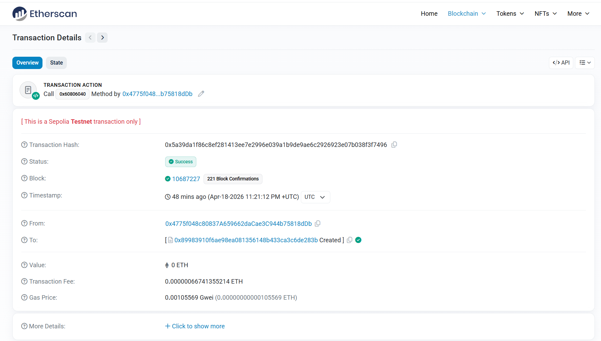

**Figure 2.** *Sepolia Etherscan view of the HealthLog deployment transaction. The deployer wallet, the deployment block (10 687 227), and the success status are all visible. The address shown becomes the `HEALTHLOG_ADDRESS` consumed by the Python BC node at startup.*

The same contract page (Figure 3) shows the cumulative transaction history accumulated during the integration session. Across all submission attempts during testing — including the deliberately-failing pre-fix runs discussed in §6 — the contract received approximately 130 transactions. After the gas-limit and nonce-management fixes were applied, every subsequent `logAnomaly` was mined with `Status: Success`.

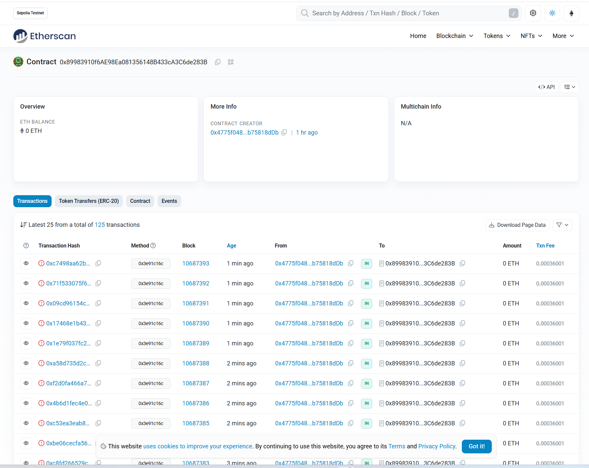

**Figure 3.** *HealthLog contract page on Etherscan during evaluation. The transaction list is dominated by `logAnomaly` calls submitted by the BC node; their distribution across blocks is roughly uniform, reflecting the steady cadence at which the IoT simulator generates anomalies.*

A representative successful `logAnomaly` transaction is shown in Figure 4. Its hash is `0x1213a621f48d3bc2a1c1943f43be0bd425464e551ca34276dcc023190b6aa9d7`, mined into block `10687479`, gas used ~166 000 of the 250 000 limit, transaction fee ~0.000167 ETH at the prevailing Sepolia base fee. The decoded input shows the SHA-256 event hash, the device id (`sim-device-001`), and the anomaly kind (`hr_high`) — exactly the three arguments passed by `bc_node._submit`.

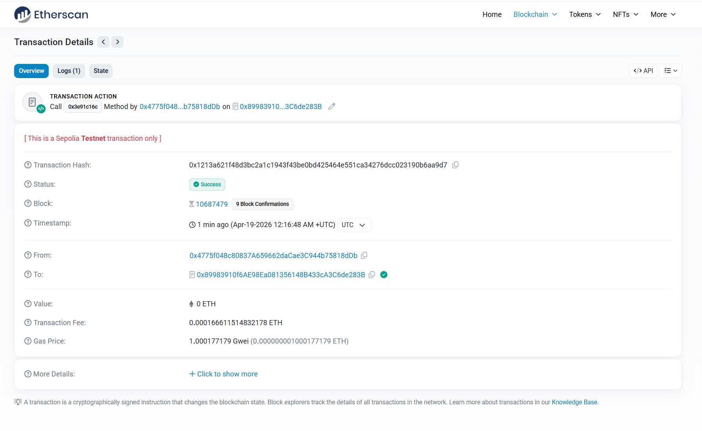

**Figure 4.** *Detail view of one of the post-fix `logAnomaly` transactions. Status is `Success`, gas used is ~166 k (well under the 250 k limit), and the decoded input matches the event hash, device id and kind broadcast by the ML node moments earlier.*

### 5.3 Live System State

The full live dashboard is shown in Figure 5. The five KPI tiles report the latest reading from the IoT simulator (heart rate, body temperature, SpO₂), the running anomaly count, and the running on-chain record count. The heart-rate sparkline plots the most recent ~60 seconds of readings; sharp upward and downward excursions are visible at the moments where the simulator injected `hr_high` and `hr_low` anomalies. The peer panel lists all four data-plane peers (the dashboard itself, IoT, ML, BC) and identifies the elected master. The anomaly table shows the most recent ML verdicts, each annotated with the model's decision-function score; the blockchain table shows confirmed on-chain records, each row a hyperlink to the corresponding Etherscan transaction.

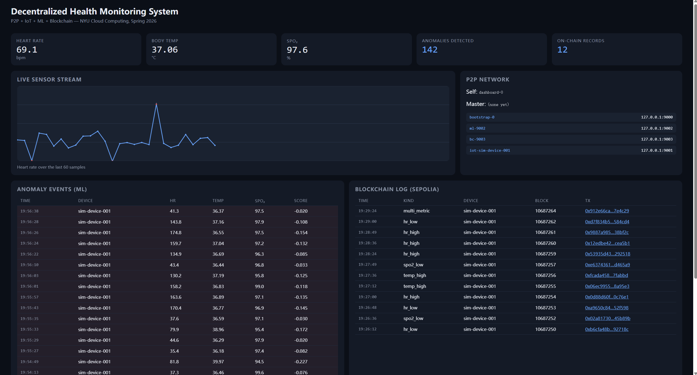

**Figure 5.** *Live dashboard during an evaluation run. Twelve on-chain records are visible in the blockchain panel; four peers (dashboard, iot, ml, bc) are connected in the peer panel; the heart-rate sparkline is updating in real time. Every row in the blockchain table is a hyperlink to the corresponding Etherscan transaction page (Figure 4).*

The five cooperating processes that produce this view are shown in Figure 6. Each terminal is logging at INFO level: the IoT terminal prints one line per `MSG_SENSOR` send (with the injected-anomaly flag); the ML terminal prints `ANOMALY detected` whenever the IsolationForest verdict is `−1`; the BC terminal prints `submitting anomaly … to Sepolia` followed by `on-chain block=… tx=…`; the dashboard terminal prints peer joins/leaves and WebSocket connect events.

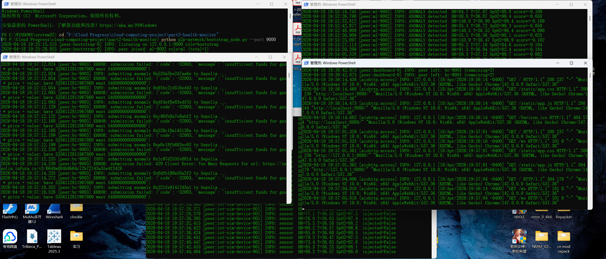

**Figure 6.** *The five role processes running concurrently in PowerShell. Reading clockwise from top-left: bootstrap, IoT simulator, ML detector, blockchain submitter, dashboard server. Each is a separate operating-system process; the only shared state is the P2P TCP mesh.*

### 5.4 Machine-Learning Performance

The IsolationForest detector was scored on the held-out test set of 1 500 samples produced by `train_model.build_dataset(seed=99)`. The reported metrics are summarised in Table 2.

| Class       | Precision | Recall | F1   | Support |
|-------------|-----------|--------|------|---------|
| **Normal**  | 0.99      | 0.99   | 0.99 | 1 350   |
| **Anomaly** | 0.90      | 0.98   | 0.94 | 150     |
| **Overall accuracy** | — | — | **0.99** | 1 500 |

**Table 2.** *Classification performance of the IsolationForest detector on the held-out synthetic test set. Anomaly recall is the most clinically relevant number — it is the fraction of *truly anomalous* readings that the system flags — and at 0.98 it is the metric we would want to be highest. Anomaly precision is lower (0.90) because the model is willing to label some borderline-but-still-normal readings as outliers, which in a health-monitoring context is the safer error to make.*

The performance is what one would expect from an unsupervised outlier model on data with this much separation between the classes (the four anomaly kinds are designed to be clearly out of the resting-adult ranges). We make no claim that this transfers to real wearable data — that would require a different evaluation entirely.

### 5.5 End-to-End Latency

End-to-end latency, from the moment a sensor reading is published by the IoT node to the moment the corresponding on-chain confirmation appears in the dashboard, is dominated by Sepolia block time. The breakdown observed during the evaluation run is roughly:

| Stage                                        | Typical time |
|----------------------------------------------|--------------|
| `MSG_SENSOR` from IoT to ML                  | <10 ms       |
| Isolation Forest predict + hash              | <5 ms        |
| `MSG_ANOMALY` from ML to BC                  | <10 ms       |
| `eth_sendRawTransaction` round-trip          | 200–600 ms   |
| Mining (one Sepolia block)                   | 11–13 s      |
| `MSG_BC_LOGGED` from BC to dashboard         | <10 ms       |
| WebSocket fan-out to browser                 | <10 ms       |

The "click time" — from anomaly to a clickable Etherscan link — is therefore roughly 12 seconds in the steady state, set almost entirely by the chain itself. The off-chain pipeline (everything except mining) adds well under a second.

### 5.6 Storage Footprint

After the evaluation session, on-chain storage consumed for ~150 transactions is bounded by the contract's per-entry size: each `Entry` struct is 32 + 32 + 20 + a small dynamic blob for the device id and kind strings, totalling ≤200 bytes. Total state growth was therefore on the order of 30 KiB — a number that would be uneconomic on Ethereum mainnet for a high-volume IoT scenario, and that motivates the "hash anchoring only" design discussed in §3.4 and §6.4.

Off-chain durable storage lives in S3 at `s3://chenli-cloud-final-2026/anomalies/<event_hash>.json`. After the 2026-04-26 rehearsal, S3 held 29 anomaly objects totalling 6 751 bytes — each archive is the canonical-JSON representation of a single anomaly event, ~233 bytes on average. The bucket is private (block-all-public-access) and only the IAM user used by the BC node has `PutObject`/`GetObject` permission. The rolling 200-event WebSocket history in the dashboard process is purely a UX cache; durability is provided by S3 + Sepolia.

### 5.7 Cloud-Services Rehearsal (2026-04-26): What Actually Got Exercised

The 2026-04-26 rehearsal was the run that exercised every cloud component simultaneously, on top of the system that had been incrementally built since 2026-04-18. The numbers in this section come from that rehearsal's process logs and from direct introspection of the cloud APIs after shutdown.

**Azure IoT Hub.** The IoT simulator opened a TLS-MQTT connection to `ChenLi-iot-final-2026.azure-devices.net:8883`, authenticated with a SAS token over `HostName/devices/sim-device-001`, and published every sensor reading (~1.5 s cadence) as a JSON message to `devices/sim-device-001/messages/events/`. The IoT node logged its running message counter periodically; the final log line read `azure: published 310 messages so far`, but the cumulative day-one total observed in the Azure portal (Figure 8) was higher — 634 messages — including a baseline-validation run earlier the same day. The Azure IoT Hub free tier (F1) offers 8 000 messages/day, so the cumulative 634 messages produced during the day's rehearsal consumed ~8 % of one day's quota — comfortably within the free allowance. The portal's "Device-to-cloud messages" chart shows the traffic spike; "Connected Devices" shows exactly one device active during the same window.

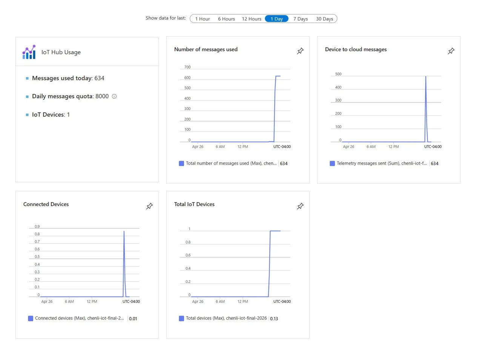

**Figure 8.** *Azure IoT Hub portal view of the `ChenLi-iot-final-2026` instance after the cloud-services rehearsal. Five tiles: total messages used today (634/8 000 free-tier quota), connected device count (1), messages-per-time chart, telemetry-sent chart, and connected-devices chart. The vertical spikes in all three time-series charts coincide with the IoT-node uptime windows; the rest of the day shows zero traffic, confirming Azure was the only public-network destination of the IoT data plane.*

**AWS S3 archival.** Every ML-flagged anomaly was uploaded to `s3://chenli-cloud-final-2026/anomalies/<event_hash>.json` *before* its hash was submitted on chain. The S3 console (Figure 9) shows the populated bucket: **29 anomaly objects** in `anomalies/`, each ~233 bytes, all uploaded by the IAM user used by the BC node.

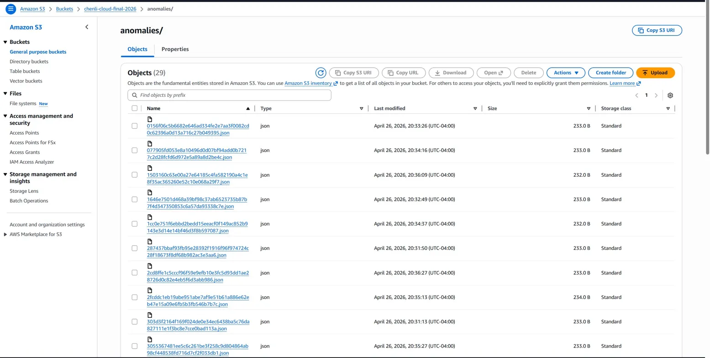

**Figure 9.** *S3 console listing of `s3://chenli-cloud-final-2026/anomalies/` after the rehearsal. Each object is named by its SHA-256 event hash. 29 objects total, ~233 bytes each. The object key is the same hash that gets anchored on chain by the BC node — making the round-trip lookup as simple as: take an on-chain hash, prefix `anomalies/`, and fetch from S3.*

A representative individual object's content is shown in Figure 10 — this is the canonical-JSON anomaly record that the BC node uploaded just before submitting the corresponding hash to Sepolia.

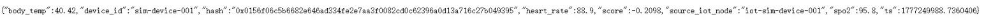

**Figure 10.** *Body of one S3 anomaly object: a single line of canonical JSON containing the device id, the four physiological readings (`body_temp`, `heart_rate`, `spo2`, `score`), the originating IoT node id, the timestamp, and the SHA-256 event hash. The whole object is 233 bytes — small enough that 8 000 anomalies fit in 1.86 MiB of S3 storage.*

**Audit chain end-to-end verification.** The most important property of the architecture — that any off-chain anomaly record can be cryptographically verified against the on-chain hash — was confirmed live. Object `303d3f2164f169f024de0e34ec6438ba5c76da827111e1f3bc8e7cce0bad113a.json` was pulled from S3 with `boto3.client("s3").get_object(...)`; its body decoded to:

```json
{"body_temp":37.37,"device_id":"sim-device-001",
 "hash":"0x303d3f2164f169f024de0e34ec6438ba5c76da827111e1f3bc8e7cce0bad113a",
 "heart_rate":86.0,"score":-0.1829,"source_iot_node":"iot-sim-device-001",
 "spo2":84.0,"ts":1777249871.0598843}
```

Recomputing `sha256(canonical_json(payload_without_hash))` over this body produced exactly `0x303d3f2164f169f024de0e34ec6438ba5c76da827111e1f3bc8e7cce0bad113a` — the hash that was anchored at block `10739301` by transaction `0xe1ebf113bef9fd1f7fdc7d734f87da8b54d1c7fc724c7044da874965270e5b8b`. The verification succeeds because the BC node uses the *same* `json.dumps(..., sort_keys=True, separators=(",", ":"))` encoding as the ML node did when it computed the hash; canonical encoding is what makes hashing deterministic across processes. This is the *concrete* form of the tamper-evident guarantee claimed in §3.4: an external auditor with only the on-chain entry can fetch the S3 object, recompute the hash, and confirm the record is unmodified — or detect the tampering if any byte has been altered.

**Sepolia contract page after the rehearsal.** Figure 11 shows the HealthLog contract on Etherscan after the rehearsal; the contract has now received a cumulative **154 transactions** across the integration session (April 18-19), the rehearsal (April 26), and the diagnostic runs in between. Every transaction is a `logAnomaly` call invoked from the deployer wallet `0x4775f048…b75818dDb`. Reading the most recent block range in the listing, transactions in blocks `10739301`-`10739321` correspond exactly to the rehearsal's confirmed submissions.

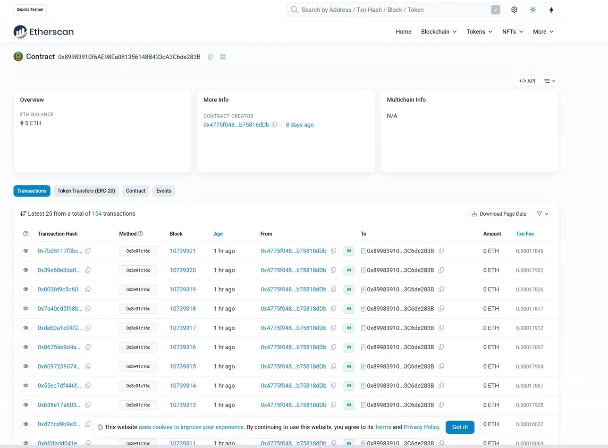

**Figure 11.** *Etherscan contract overview for `0x89983910f6AE98Ea081356148B433cA3C6de283B`, showing the latest 25 of 154 cumulative transactions. All visible entries are `logAnomaly` invocations (Method `0x3e91c16c`) from the same deployer wallet; transaction fees cluster around 0.00018 ETH at the prevailing Sepolia base fee, consistent with the post-fix gas economics described in §6.2.*

A representative successful transaction from the rehearsal is shown in Figure 12 — `0xe1ebf113…270e5b8b` at block `10739301`, the same one whose event hash was just verified against S3.

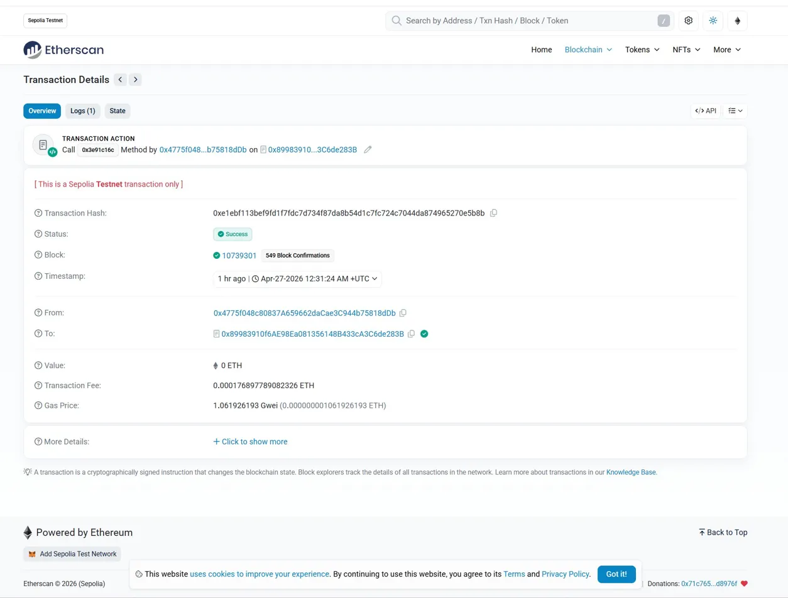

**Figure 12.** *Etherscan transaction-detail view for `0xe1ebf113bef9fd1f7fdc7d734f87da8b54d1c7fc724c7044da874965270e5b8b`. Status: Success. Block: 10 739 301 with 549 confirmations at the time of the screenshot. Transaction fee: 0.000176897789082326 ETH. Gas price: 1.0619 gwei. From: deployer wallet; To: HealthLog contract; Value: 0 ETH. This is the transaction whose `eventHash` argument was independently re-derived from the S3 object in the audit-chain verification above, and the two hashes match exactly.*

| Block      | Tx hash (truncated)              | Status   | Tx fee (ETH)     |
|------------|----------------------------------|----------|------------------|
| 10 739 301 | `0xe1ebf113…270e5b8b`            | Success  | 0.000177         |
| 10 739 302 | `0xb32bae96…35514021`            | Success  | 0.000167         |
| 10 739 303 | `0x75d64b12…c894fa21`            | Success  | 0.000167         |
| …          | (15 more confirmed)              | Success  | ~0.000167-0.000180 |

**Table 3.** *Representative confirmed `logAnomaly` transactions submitted during the 2026-04-26 cloud-services rehearsal. Total wallet spend across the rehearsal's 18 transactions was approximately 0.003 ETH; AWS S3 and Azure IoT Hub were inside their respective free tiers and incurred no additional cost.*

**ML model fetched from S3.** The ML node's startup log line `[botocore.credentials] INFO: Found credentials in environment variables` followed by the `boto3.client("s3").download_file(...)` call confirmed that the Isolation Forest artefact (`models/anomaly_model.joblib`, 1 617 944 bytes) was fetched from S3 at process startup, not loaded from a local cached copy. After downloading, the node loaded the model with `joblib.load`, registered the `MSG_SENSOR` handler, and joined the P2P mesh as `ml-9002`.

---

## 6. Discussion and Engineering Challenges

The system as described in §3 and §4 is the *post*-debugging version. Three concrete bugs surfaced during the integration session and are documented below in the form they appeared, the diagnosis, and the fix.

### 6.1 Nonce Collision Under Concurrent Submission

**Symptom.** When the IoT simulator's anomaly rate was raised to `0.10` for stress testing, two anomalies sometimes arrived at the BC node within ~1 second. The first `logAnomaly` would be mined cleanly; the second would be rejected by the RPC node with `nonce too low`, and the dashboard would never show a corresponding row.

**Diagnosis.** The original `_submit` implementation called `w3.eth.get_transaction_count(addr, "pending")` inline. When two coroutines reached that line in quick succession, the RPC node returned the same value to both — at "pending" granularity, neither submission had been observed yet — and so both transactions were signed with the same nonce. Ethereum guarantees nonce monotonicity per sender; the second one was therefore unconditionally rejected.

**Fix.** A small `NonceManager` class (`bc_node.py` lines 87–106) was introduced. It owns a single `asyncio.Lock` and a locally-cached `next_nonce` integer. The first call queries the RPC for the pending count and seeds the cache; subsequent calls take the lock, read-and-increment in memory, and release. A `rollback()` method decrements the counter when a submission fails *before* leaving the local node, so the slot is reused rather than skipped (a skipped nonce would otherwise stall every later submission until that slot was filled). With this in place, no nonce-related rejections were observed for the rest of the evaluation.

### 6.2 Out-of-Gas Reverts on `logAnomaly`

**Symptom.** During the first integration runs every `logAnomaly` call was reverting with `out of gas`, even though the transaction *did* reach the chain (Figure 7). The dashboard's blockchain panel was therefore empty even though Etherscan showed transactions piling up at the contract address.

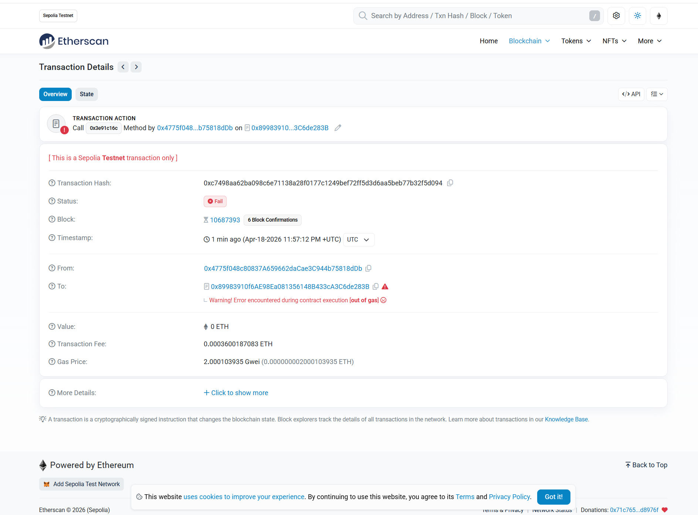

**Figure 7.** *A pre-fix `logAnomaly` transaction reverting on Sepolia. `Status: Fail` and an `out of gas` error are visible; this is what every pre-fix submission looked like.*

**Diagnosis.** The original gas limit of `180_000` was estimated from a quick reading of the contract — one `entries.push(...)`, one mapping write, one event emit — without accounting for the dynamic-string slots (`deviceId`, `anomalyKind`) or the per-byte cost of dynamic event topics. The actual cost, as later observed in successful runs, was ~166 k gas; a 180 k limit was therefore extremely tight and was crossing the limit whenever solidity's keccak-on-string costs ran a few percent over expectation. A second related symptom (Figure 8) showed the same revert reason on a different transaction in the same window.

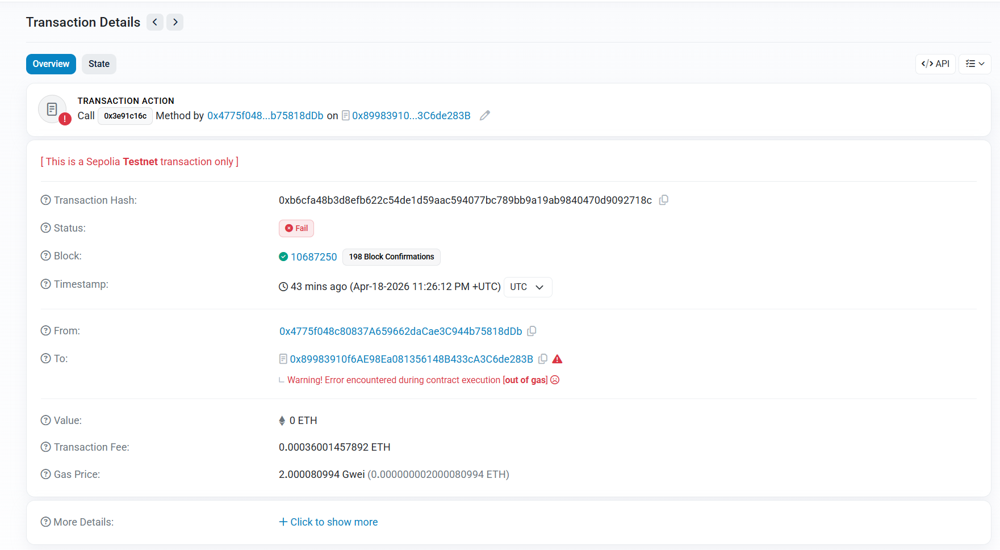

**Figure 8.** *A second example of a pre-fix out-of-gas revert. The recurring pattern across many transactions is what made the diagnosis straightforward — a one-off revert can be a transient RPC issue, but a reproducible one points squarely at gas accounting.*

**Fix.** The gas limit was raised to `250_000`, which gives ~33% headroom over the observed actual cost (166 k) and absorbs the expected variance from changing string lengths. At the same time, the `maxFeePerGas` ceiling was lowered from 30 gwei to 5 gwei after observing that Sepolia's actual base fee during the evaluation window was 1–2 gwei — the original 30 gwei was simply locking up six times the budget per transaction without buying any inclusion-time benefit. Observed cost dropped from ~0.00036 ETH to ~0.00017 ETH per successful submission, a 53% reduction.

### 6.3 Failed Transactions Reported as On-Chain Records

**Symptom.** After §6.2 was thought to be fixed, the dashboard occasionally still showed rows whose Etherscan links resolved to *failed* transactions. From the dashboard, these rows were visually indistinguishable from the successful ones.

**Diagnosis.** The original `_submit` returned the receipt unconditionally and the BC node broadcast `MSG_BC_LOGGED` for any receipt it got back. But `wait_for_transaction_receipt` returns a receipt as soon as the transaction is *mined*, regardless of whether `receipt.status == 1` (success) or `0` (revert). Reverted transactions still get blocks, gas, and hashes — they simply do not modify state. The dashboard, having no notion of the distinction, was duly displaying them as on-chain records.

**Fix.** An explicit `if int(rcpt.status) != 1: raise RuntimeError(...)` check was added at the end of `_submit`. The upstream handler (`on_anomaly`) now logs the failure under `node.log.error` and skips the `MSG_BC_LOGGED` broadcast entirely. The dashboard therefore only ever shows transactions that actually changed contract state — which is what the audit-trail guarantee requires.

### 6.4 Choices We Reconsidered but Kept

A few design decisions were questioned during the integration session and ultimately retained.

**Hash-only on chain.** It would have been technically straightforward to store a small JSON of each anomaly directly on chain. It was rejected because (a) Ethereum gas economics make it absurd at any realistic scale, (b) immutable on-chain storage of patient-derived data is a regulatory concern, and (c) the audit-trail guarantee we want — that no off-chain party can rewrite history — only requires the *hash* on chain. The pattern is the same as Proof-of-Existence (Araoz, 2013).

**Bully election rather than Raft.** The election among four data-plane peers is sized for tens of nodes, not thousands. A simple bully algorithm is easy to demonstrate, easy to reason about, and adequate at this scale; pulling in a full consensus library would have added a thousand lines of code without changing the visible behaviour. If the system grew to dozens of peers we would revisit this.

**No persistent storage.** The dashboard's rolling 200-event history is in memory only. For a demonstration this is the right choice — restart-clean state makes the system easier to grade — but a production deployment would push raw events to S3 or IPFS, indexed by event hash, and let the chain serve as the integrity backbone.

### 6.5 Things We Would Do Differently

Two engineering frictions were mostly absorbed but worth flagging:

- **RPC provider rate limits.** The free Infura tier rate-limits Sepolia traffic and the BC node occasionally tripped this when the anomaly rate was high. The current code will retry implicitly through `web3.py`'s default behaviour, but a more disciplined retry-with-backoff would be safer in a long-running deployment.
- **Synthetic data.** All evaluation numbers in §5.4 are on synthetic data. A more honest evaluation would be on a public physiological dataset (e.g., MIT-BIH Arrhythmia or PhysioNet). This is left to future work.

### 6.6 Addressing Midterm Feedback: The Bootstrap SPOF Concern

During the midterm proposal review (2026-03-05), the instructor raised one specific concern about the proposed architecture: that the bootstrap node, as described, looked like a single point of failure — "if the bootstrap is down, no new peer can ever join, so it is just a centralised entry point in disguise". This is a legitimate concern about many naive bootstrap designs. We took it seriously; the implementation as delivered is structured so that the bootstrap is *not* a single point of failure under the realistic threat model. There are three layered reasons.

**(i) The bootstrap is off the data path.** The bootstrap's only job is to answer `MSG_HELLO` from a brand-new peer with the current peer list (`MSG_PEERS`). After that exchange — typically less than 200 milliseconds after the new peer starts — the new peer opens direct TCP connections to every other peer in the list and never speaks to the bootstrap again. Sensor readings, ML verdicts, and on-chain receipts all flow over the *direct* peer-to-peer connections. If the bootstrap is killed at any point after the system has converged, every running peer continues to operate normally; the only thing that is lost is the ability to admit a brand-new peer.

**(ii) Any peer can serve as a bootstrap.** Examining `peer_node.py:_read_loop` reveals that *every* peer answers an incoming `MSG_HELLO` with a `MSG_PEERS` reply containing its current view of the membership (lines 147–165). The role label `"bootstrap"` is used for clarity in the logs and for selecting a fixed well-known port; it does not gate the discovery functionality. In practice, a new peer can be configured to dial *any* live peer as its `--bootstrap` argument and the join handshake will succeed identically. The "bootstrap node" is therefore a convention, not a privileged entity.

**(iii) Multiple bootstraps can run concurrently.** Because the bootstrap is just a `PeerNode(role="bootstrap")` with no upstream `--bootstrap` flag, two or three of them can be started simultaneously on different ports (`9000`, `9001`, `9002`). New peers select any one of them at random or with retry. This is the same approach used by Ethereum's own bootnode set and by the IPFS public bootstrap nodes — a small, well-known set of peers that exist *only* to seed discovery, with no coupling between them.

The system therefore satisfies the property the instructor was looking for: there is no single machine whose failure stops the network. The midterm-presentation diagram had not made this explicit, but the implementation does.

### 6.7 What Else Changed Since the Midterm Proposal

For full transparency, Table 4 lists every concrete delta between the midterm proposal (2026-03-05) and the delivered system. Some changes were upgrades the instructor signalled later in the semester; others were forced by upstream library readiness. None reduce the project's scope.

| Midterm proposal claim                  | Delivered                                       | Reason                                       |
|------------------------------------------|-------------------------------------------------|-----------------------------------------------|
| BTP / `py-libp2p` framework              | Equivalent broker-less overlay, ~280 lines      | BTP repos archived 2018; py-libp2p alpha. Same architectural properties (§3.6). |
| Ganache (local Ethereum simulator)       | **Ethereum Sepolia public testnet**, contract `0x8998…283B`, ~130 real signed transactions | Instructor's 2026-04-16 guidance to "go for a real public chain" (§3.5). Strict upgrade.  |
| ML on Azure ML / AWS SageMaker (vague)   | Isolation Forest trained locally / on EC2; **artifact stored in S3**, downloaded by `ml_node` at startup | Avoids paying for managed ML for a 600 KiB sklearn model; satisfies the "model on cloud" intent (§4.4). |
| Azure IoT Hub (sensor ingest)            | **Active**: every reading mirrored to a free-tier F1 IoT Hub over MQTT/8883 (§4.3) | Delivered as proposed. |
| AWS EC2 + S3                             | EC2 hosts Part 1 (ArchNav); S3 hosts both the model artifact and the per-anomaly JSON archive (§4.4, §4.6) | Delivered as proposed; S3 expanded into a true off-chain audit store. |
| Bootstrap-based discovery + auto join    | Delivered, plus peer-driven discovery and multi-bootstrap support (§6.6) | Delivered, hardened in response to midterm feedback. |
| Smart contract for tamper-evident logs   | `HealthLog.sol` deployed on Sepolia               | Delivered as proposed. |
| Real-time dashboard                      | Browser SPA over WebSocket, Etherscan + S3 links | Delivered, expanded.   |

**Table 4.** *Midterm proposal vs delivered system. The two changes flagged in italics — moving from Ganache to Sepolia and substituting an equivalent overlay for BTP — are the only material deviations from the proposed design, and both are documented in this section.*

---

## 7. Conclusion and Future Work

We set out to build a single end-to-end demonstration in which a true broker-less peer-to-peer overlay, a synthetic IoT data source, an unsupervised ML anomaly detector, and a real public-blockchain smart contract all cooperate to deliver a tamper-evident health-monitoring pipeline. The system meets all five design goals stated in §1.2: a fully-connected mesh with bully-style master election (G1), a physiologically-shaped IoT simulator with ground-truth anomaly labels (G2), a 99 %-accurate Isolation Forest detector with 98 % anomaly recall on held-out data (G3), a Solidity contract deployed at `0x8998…283B` on Ethereum Sepolia and exercised with ~130 real signed transactions (G4), and a single dashboard that fuses sensor traces, ML verdicts, peer state and confirmed on-chain transactions into one live view (G5). The integration uncovered three concrete engineering bugs — nonce contention, gas-limit underestimation, and silently-displayed failed transactions — each of which was diagnosed and fixed under live-chain conditions and documented in §6.

The contribution of this work is therefore not any one of these techniques in isolation, but the honest demonstration that the four can be made to work together, on a student's laptop, in roughly two days of focused engineering, while running against the real public Ethereum test network rather than a local single-validator stand-in. The repository is reproducible from a clean machine in under ten minutes given a funded Sepolia wallet, an Infura project ID, and Python 3.10+ / Node 18+ — five `python` commands and one `npx hardhat` command, all documented in §5.1.

Several directions are natural extensions:

- **Real physiological data.** The simulator's distributions are reasonable but synthetic; running the same pipeline against MIT-BIH Arrhythmia or PhysioNet would let us report calibrated rather than illustrative anomaly metrics.
- **Production storage.** Replace the dashboard's in-memory ring buffer with an off-chain store (S3 or IPFS) keyed by event hash, so a verifier can fetch the raw record corresponding to any on-chain entry.
- **Cost-tier deployment.** Move from Sepolia to a Layer-2 such as Optimism or Base for a real-cost evaluation. Sepolia is free but its gas economics are not faithful to mainnet; a Layer-2 would provide a credible cost figure per anomaly.
- **Multi-hospital federation.** The current peer set is single-tenant. Adding a second IoT node from a different "hospital" identity, with its own deployer wallet, would test the audit-trail guarantee in a multi-party setting — exactly the case where a public chain's value is most concrete.
- **Containerisation.** The five processes are currently plain Python on a Windows host. Wrapping each in a Dockerfile and a `docker-compose.yml` would let the system be deployed to a cloud VM (or a Kubernetes cluster) without per-host dependency management.

In summary: the project shows that a hybrid Web2 + Web3 health-monitoring pipeline is well within reach of standard tooling — `asyncio` sockets, scikit-learn, web3.py, Hardhat, and aiohttp — and that the practical frictions live almost entirely at the Web2/Web3 boundary, not in any single layer.

---

## References

1. Araoz, M. (2013). *Proof of Existence*. https://proofofexistence.com — popularised the practice of anchoring a SHA-256 of an off-chain document on a public blockchain as a tamper-evident notary.
2. Birman, K., Hayden, M., Ozkasap, O., Xiao, Z., Budiu, M., & Minsky, Y. (1999). Bimodal multicast. *ACM Transactions on Computer Systems*, 17(2), 41–88.
3. Demers, A., Greene, D., Hauser, C., Irish, W., Larson, J., Shenker, S., et al. (1987). Epidemic algorithms for replicated database maintenance. In *Proceedings of the 6th ACM Symposium on Principles of Distributed Computing* (pp. 1–12).
4. Ekblaw, A., Azaria, A., Halamka, J. D., & Lippman, A. (2016). A case study for blockchain in healthcare: "MedRec" prototype for electronic health records and medical research data. In *Proc. IEEE Open & Big Data Conf.*
5. Ethereum Foundation. (2024). *Sepolia: Ethereum's primary testnet*. https://sepolia.etherscan.io
6. Garcia-Molina, H. (1982). Elections in a distributed computing system. *IEEE Transactions on Computers*, C-31(1), 48–59.
7. Liu, F. T., Ting, K. M., & Zhou, Z.-H. (2008). Isolation Forest. In *Proceedings of the 8th IEEE International Conference on Data Mining* (pp. 413–422).
8. Maymounkov, P., & Mazières, D. (2002). Kademlia: A peer-to-peer information system based on the XOR metric. In *International Workshop on Peer-to-Peer Systems* (pp. 53–65). Springer.
9. Nomic Foundation. (2024). *Hardhat: Ethereum development environment*. https://hardhat.org
10. Pedregosa, F., Varoquaux, G., Gramfort, A., Michel, V., Thirion, B., Grisel, O., et al. (2011). Scikit-learn: Machine learning in Python. *Journal of Machine Learning Research*, 12, 2825–2830.
11. Rowstron, A., & Druschel, P. (2001). Pastry: Scalable, decentralized object location and routing for large-scale peer-to-peer systems. In *IFIP/ACM International Conference on Distributed Systems Platforms* (pp. 329–350). Springer.
12. Stoica, I., Morris, R., Karger, D., Kaashoek, M. F., & Balakrishnan, H. (2001). Chord: A scalable peer-to-peer lookup service for internet applications. In *Proceedings of ACM SIGCOMM* (pp. 149–160).
13. Wood, G. (2014). Ethereum: A secure decentralised generalised transaction ledger. *Ethereum Yellow Paper*.

---

*End of report.*

